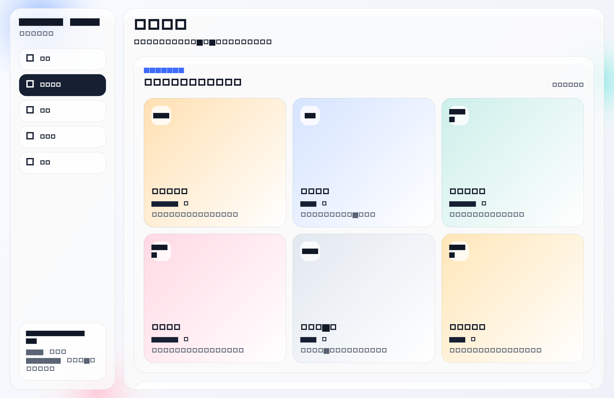
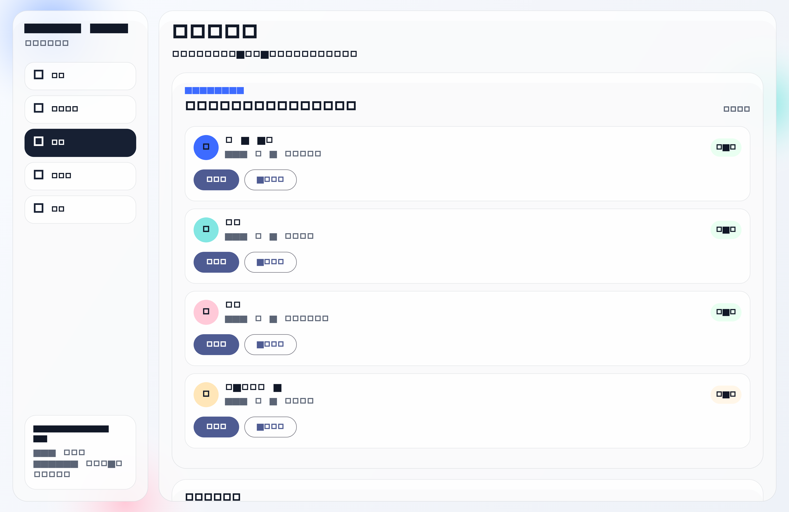
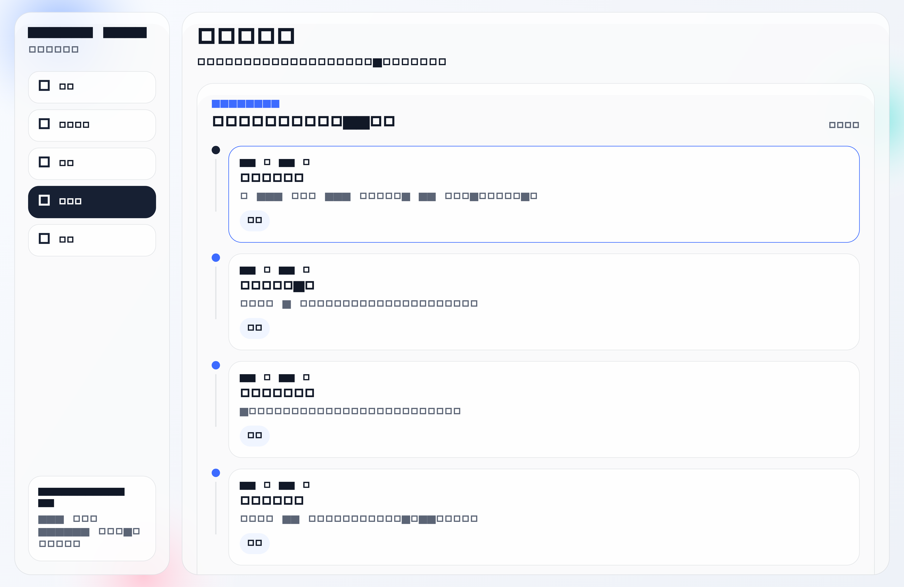
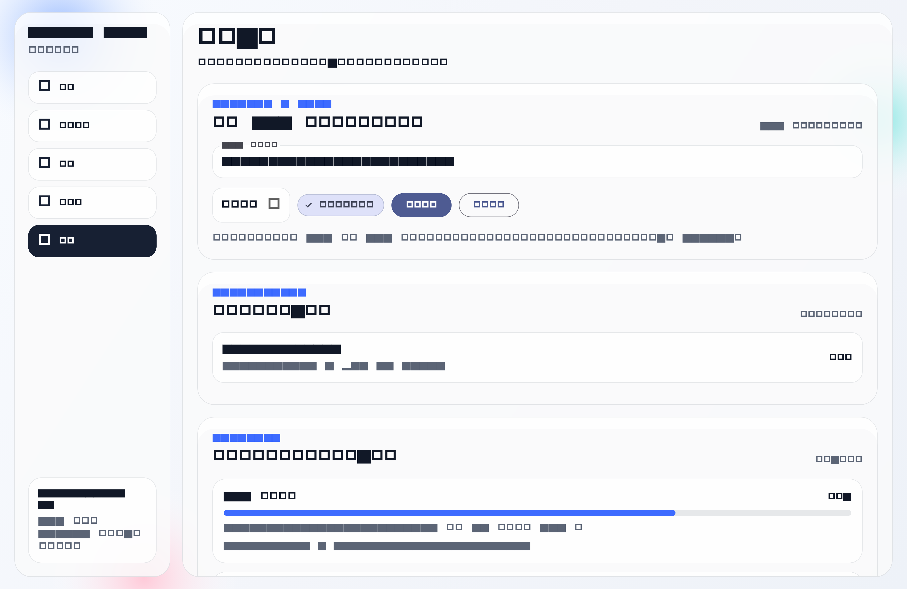

# memaster

memaster is a Flutter-first memory layer for NAS media. It turns SMB-mounted folders into smart albums, people clusters, correction loops, and event-style memory cards.

[GitHub Repository](https://github.com/yaoyao2mm/memaster)

## Current state

This repository contains:

- A polished Flutter UI skeleton for the first desktop/mobile MVP
- Product and architecture notes for the NAS memory workflow
- A design direction derived from Horizon UI and Apple-style software
- A local FastAPI service skeleton for indexing and smart-memory APIs

## Demo flow

1. Start the local API service
2. Launch the Flutter app on macOS
3. Open `整理` and submit a NAS-mounted path
4. Open `智能相册` to review scanned assets and adjust labels
5. Open `人物` to confirm identities
6. Open `时间轴` to browse memory cards and event assets

## macOS demo preview

The current desktop demo already covers the main loop of the product:
scan a mounted NAS folder, let the system group assets into semantic albums,
confirm people clusters, and revisit those materials again through event-style
timeline cards.

| Smart albums | People |
| --- | --- |
|  |  |
| Timeline | Organize |
|  |  |

## Planned product shape

`memaster` is not a generic NAS file browser. It is a personal memory layer on top of NAS media:

- Connect to a NAS over SMB or a mounted network folder
- Scan and index photos and videos
- Build smart albums such as cats, portraits, self, travel, food
- Let the user correct labels and train the system over time
- Turn media into searchable memories instead of folders

## Recommended stack

- UI: Flutter
- Local service: Python + FastAPI
- Storage: SQLite
- Vision inference: ONNX Runtime + CLIP/SigLIP + InsightFace

## Implemented demo capabilities

- Real scan jobs against SMB-mounted or local folders
- SQLite-backed asset index
- Smart album aggregation
- Asset-level label correction with persistence
- People confirmation with persistence
- Timeline memory cards with event asset drill-down
- Demo thumbnail pipeline for assets

## Local API service

```bash
cd service
uv sync
uv run uvicorn app.main:app --reload --port 4318
```

## Flutter demo

```bash
flutter pub get
flutter run -d macos
```

## Trigger a real scan from Flutter

1. Mount your UGREEN NAS over SMB so it appears as a local path such as `/Volumes/UGREEN/HomeMedia`
2. Start the local API service
3. Launch the Flutter app
4. Open the `整理` page
5. Paste the mounted path and click `开始扫描`

## Repository structure

- `lib/`: Flutter app
- `service/`: local FastAPI service
- `docs/`: product, API, and roadmap notes
- `.github/`: issue and PR templates
